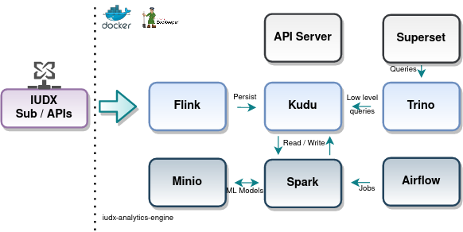
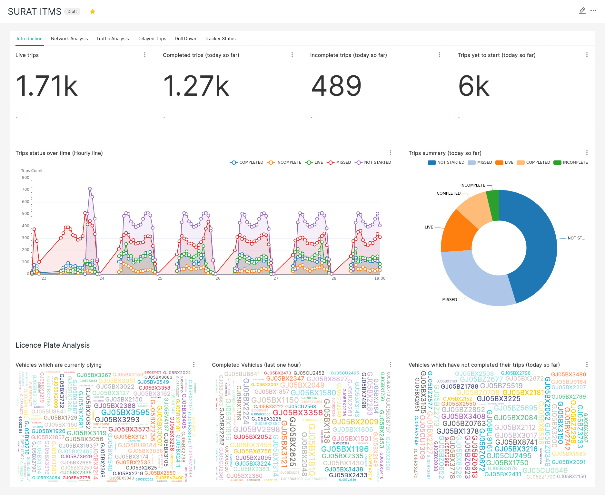
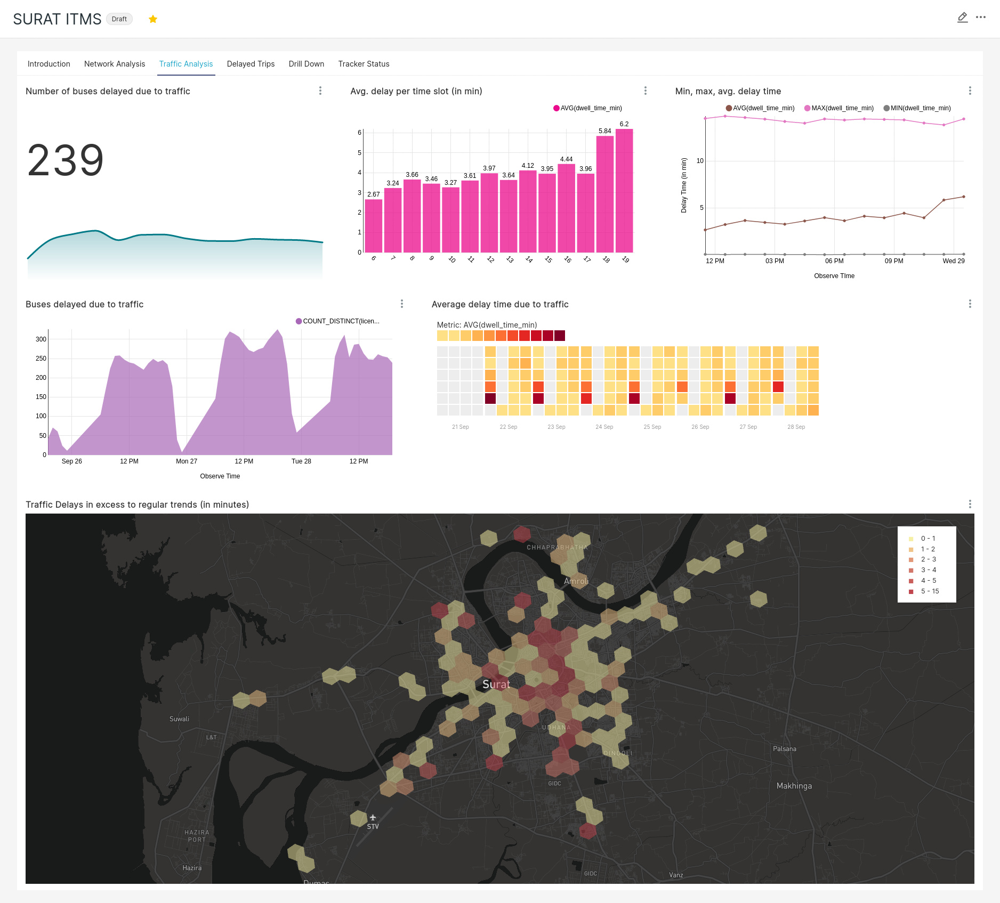

# IUDX Analytics Engine

The IUDX Analytics Engine is a high performance, highly available, 
comprehensive analytics backend to handle streaming analytics and big 
data ML jobs with a complementary visualization frontend.

Few of the prominent components used in this are - 
- [*Flink*](https://flink.apache.org/) - Stream processing engine and DB persistence driver
- [*MinIO*](https://min.io/) - S3 compatible object storage. Stores stream processing pipeline state, checkpoints and ML / DL trained models
- [*Zookeeper*](https://zookeeper.apache.org/) - High availability config store 
- [*Kudu*](https://kudu.apache.org/) - High performance OLTP + OLAP datastore 
- [*Trino*](https://trino.io/) - Fast distributed SQL query engine frontending Kudu tables
- [*Superset*](https://superset.apache.org/) - Visualization engine with large scale distribution capabilities.
- [*Airflow*](https://airflow.apache.org/) - Analytic job scheduler

### Setup
- [System Requirements](./docs/sysreq.md)
- [Component bringup]()

### Analytic Applications
Once the backend has been setup you may run our domains specific
applications from [this](this) repository.

Few screenshots of a transit management system application are below.

### Future works
1. Complex event processing
2. API Server for user interactions
3. Deep learning pipelines
